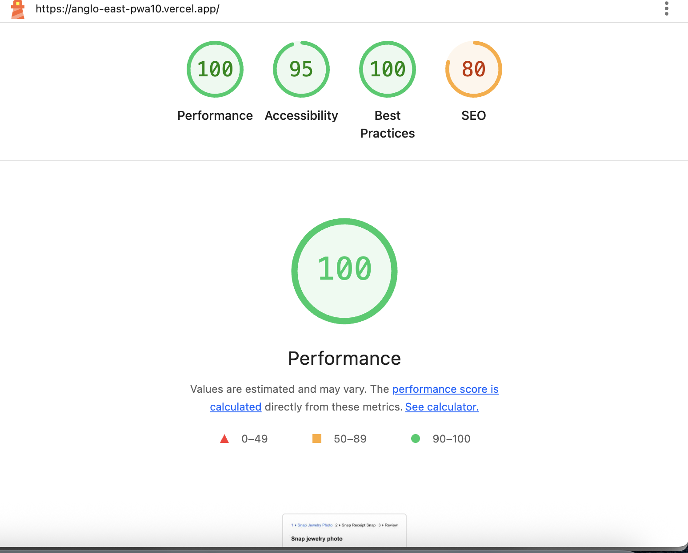

This is a [Next.js](https://nextjs.org) project bootstrapped with [`create-next-app`](https://nextjs.org/docs/app/api-reference/cli/create-next-app).

## Getting Started

First, run the development server:

```bash
npm run dev
# or
yarn dev
# or
pnpm dev
# or
bun dev
```

Open [http://localhost:3000](http://localhost:3000) with your browser to see the result.

You can start editing the page by modifying `app/page.tsx`. The page auto-updates as you edit the file.

This project uses [`next/font`](https://nextjs.org/docs/app/building-your-application/optimizing/fonts) to automatically optimize and load [Geist](https://vercel.com/font), a new font family for Vercel.

## Explanation of blur algorithm & OCR approach.

- We down-scale the photo to 512 px on the longer edge, convert it to luma and run a 3 × 3 Laplacian filter ( [[0,1,0],[1,-4,1],[0,1,0]] ).

- The variance of all Laplacian responses is a single focus score: sharp frames score in the hundreds/thousands, soft frames < 10. We reject shots whose score falls below threshold (10). 

- Whole loop runs inside an OffscreenCanvas and finishes in ≈ 10 ms on modern phones; no libraries or network required.

## Explanation of blur algorithm & OCR approach

- We spin up a Tesseract-JS worker in the browser (createWorker(["eng"])), recognise the receipt image and grab the full plain-text transcription (data.text). 

- If data.lines[] is present, we take the top-most line whose confidence ≥ 80 % as the store name; otherwise we fall back to the first all-caps line in the raw text. 

- The worker is terminated immediately after use, so memory stays low, and everything works fully offline once the PWA is installed.

## Screenshot of Lighthouse PWA score.



